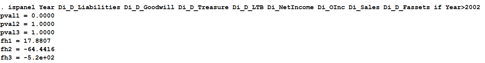

<h1>Скрипт для тестирования сливаемости данных в панель   (т.е. в панельный тип данных)</h1>

<a href="#ENG">In English</a>

Скрипт написан для статистического пакета Stata.

<b>Что делает эта программа:</b>

 Скрипт (программа) оценивает 3 модели (методом МНК):

<ul>
<li>$$1) {{Y}_{it}}={{X}_{it}}{{\beta }_{i}}+{{\alpha }_{i}}$$</li>
<li>$$2) {{Y}_{it}}={{X}_{it}}\beta +{{a}_{i}}$$</li>
<li>$$3) {{Y}_{it}}={{X}_{i.}}\beta +\alpha $$
$${{X}_{i.}}=\sum \frac{{{X}_{it}}}{{{n}_{i}}}$$</li>
</ul>

Оцениваемые модели: 1) Unrestricted panel Least Squares; 2) LSDV - Least Squares with Dummy Variables; 3) BE - Between panel model.

Затем, по оцененным моделям считаются тестовые статистики для следующих гипотез:

<ul>
<li>1) <b>H0:</b> Unrestricted panel Least Squares; <b>H1:</b> LSDV - Least Squares with Dummy Variables; </li>
<li>2) <b>H0:</b> Unrestricted panel Least Squares; <b>H1:</b> BE - Between panel model; </li>
<li>3) <b>H0:</b> LSDV - Least Squares with Dummy Variables; <b>H1:</b> BE - Between panel model; </li>
</ul>

<b>Как использовать программу:</b>

<ul>
<li>1) файл с программой (<b>ispanel.ado</b>) поместить в папку для личных дополнений Stata (обычно это папка: <b>C:\ado\personal\</b>)</li>
<li>2) вызвать выполнение программы в Stata набрав команду в формате: <b><i>ispanel переменная_идентификатор_панели зависимая_переменная список_независимых_переменных</i></b></li>
<li>3) по завершении выполнения программы отобразится посчитанная статистика.</li>
</ul>

<b>Пример выполнения программы на тестовых данных:</b>

<h1 id="ENG">Script for testing </h1>
