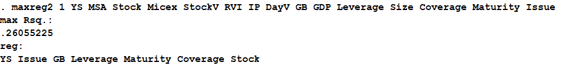

<h1>Скрипт для поиска регрессии с максимальным Rsq.</h1>

<a href="#ENG">In English</a>

Скрипт написан для статистического пакета Stata.

<b>Что делает эта программа:</b>

Скрипт строит модель (расчитываемую методом МНК) в несколько этапов. На каждом этапе в модель добавляется 1 (одна) новая независимая переменная (из списка независимых переменных), обеспечивающая наибольшее значение коэффициента детерминации Rsq. Одновременно контролируется, чтобы все переменные модели были значимые (хотя бы на 5% уровне значимости). Работа программы завершается тогда, когда не удается добавить в модель ни одной новой переменной так, чтобы при этом все переменные модели были значимы. 

<b>Как использовать программу:</b>

<ul>
<li>1) файл с программой (<b>maxreg2.ado</b>) поместить в папку для личных дополнений Stata (обычно это папка: <b>C:\ado\personal\</b>)</li>
<li>2) вызвать выполнение программы в Stata, набрав команду в формате: <b><i>maxreg2 1 зависимая_переменная список_независимых_переменных</i></b></li>
<li>3) по завершении работы отображается максимальное значение Rsq (которое удалось получить) и эконометрическая модель, обеспечивающая такое значение Rsq.</li>
</ul>

<b>Пример выполнения программы на тестовых данных:</b>

<h1 id="ENG">Script to search regression with maximum Rsq.</h1>

This script is written for Stata statistical software.

<b>What this program is doing:</b>

Script creates a model (calculated by Least Squares Method) in few steps. In each step 1 (one) new independent variable (from the list of independent variables), which gives maxumum value of the determination coeffecient Rsq, is adding to the model. Simultaniously it is controlling thal all the variables in the model is meaningfull (at least at 5% level of meaningfulness). Execution of the program finishes when there is no new variable can be added without making some of the variables in the model not meaningfull.

<b>How to use this programm:</b>

<ul>
<li>1) place file with program (<b>maxreg2.ado</b>) in the folder for personal Stata plugins (usually this folder: <b>C:\ado\personal\</b>)</li>
<li>2) call programm execution in Stata by command in format: <b><i>maxreg2 1 dependent_variable list_of_independent_variables</i></b></li>
<li>3) after program finishes the execution, it will show maximum value of Rsq (acquired) and an econometrical model which gives this value of Rsq.</li>
</ul>

<b>Example of program execution on test data:</b>

